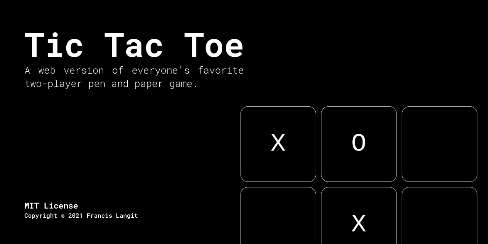
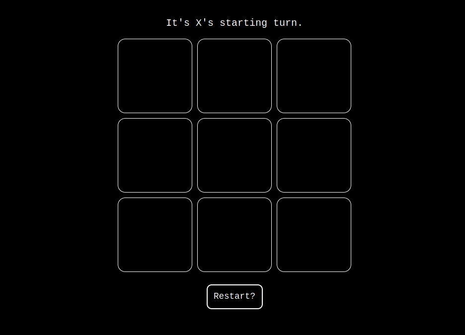

`tic-tac-toe` is a Vanilla JS web application where users can play a two-player version of the famous pen-and-paper game. Such was created in [partial completion of The Odin Project's Full Stack JavaScript path curriculum](https://www.theodinproject.com/paths/full-stack-javascript/courses/javascript/lessons/tic-tac-toe).

# Installation

[A live demo of `tic-tac-toe` is available on GitHub pages.](https://francislangit.github.io/bookly/)

However, should one like to run the application on their local machine:

1. Clone the repository with `git clone https://github.com/FrancisLangit/tic-tac-toe` or download it as a `.zip` file and extract it.
2. Navigate to where the repository is saved on your local machine and open up its `index.html` file on your preferred web browser.

## Usage

Don't know how to play tic-tac-toe? [Click here](https://en.wikipedia.org/wiki/Tic-tac-toe) for information on how to play the game. Other than that though, go grab a friend and play! First one to a row, column, or diagonal of three wins. Should a round end, press the button below the game board to start again.

## Contributing

Anyone is welcome to make a pull request should they seek to make a major change. It is, however, recommended that an issue be submitted first in order that the potential contribution be reviewed before it is constructed. One is also free to submit either of such should a bug be found.

## License

[MIT License](https://github.com/FrancisLangit/tic-tac-toe/blob/prepare-for-publicity/LICENSE)
